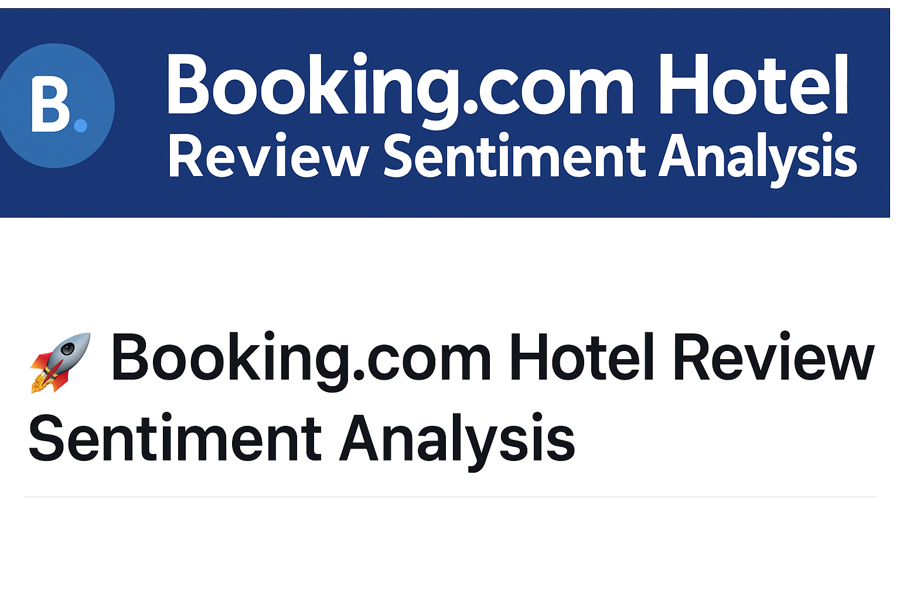

# 🏨 Booking.com Review-Based Sentiment Modelling




---

## 📘 Overview

This project explores 1,500 hotel reviews from Booking.com to extract insights into customer sentiment. Using Natural Language Processing (NLP) techniques like **sentiment scoring**, **topic modeling (LDA)**, and **geospatial analysis**, we uncover themes that impact guest satisfaction and provide actionable business recommendations.

---

## 📁 Live Orange Workflow

You can explore the full Orange data mining workflow below:

🔗 [Download the Orange Workflow (.ows)](workflow/booking_sentiment_workflow.ows)

> 📌 Open it in [Orange](https://orangedatamining.com/download/) to view the full visual pipeline.


---

## 📊 Dataset Summary

- 📍 **Hotel:** La Veranda Hotel, Larnaca, Cyprus  
- 🧾 **Reviews:** 1,500 guest reviews from Booking.com  
- 🗂️ **Source:** [Kaggle – Booking.com Hotel Reviews](https://www.kaggle.com/datasets/michelhatab/hotel-reviews-bookingcom/data)

---

## 🔍 Analytical Workflow

### ✅ 1. Sentiment Analysis

- Compound sentiment scores calculated using NLP tools
- Majority of reviews are strongly positive  
- Negative sentiments correlate with cleanliness, noise, and check-in issues


---

### 🧠 2. Topic Modeling (LDA)

| Theme    | Positive Keywords        | Negative Keywords        |
|----------|--------------------------|--------------------------|
| Service  | staff, friendly, helpful | rude, slow               |
| Room     | clean, spacious, quiet   | dirty, small, noisy      |


---

### 🌍 3. Geospatial & Cultural Analysis

- Guests from Europe/North America showed high satisfaction
- Lower ratings often came from cultural/language mismatches


---

## 🎯 Business Impact & Recommendations

| Area         | Recommendation                        |
|--------------|----------------------------------------|
| Cleanliness  | More frequent audits & cleaning        |
| Noise        | Soundproof rooms and night policy      |
| Check-in     | Add kiosks and streamline process      |
| Marketing    | Highlight top positives in listings    |
| Cultural Fit | Offer multilingual check-in info       |

---

## 🛠 Tools & Technologies

- **Python**: NLTK, spaCy, Seaborn
- **Orange**: Workflow for NLP & LDA
- **Geopy**: Geo-tagging countries
- **Matplotlib**: Visualizations

---

## 📂 Repository Structure

```
📦 Review-Based-Sentiment-Modelling/
├── data/
│   └── booking_reviews.csv
├── assets/
│   ├── A_banner_displayed_at_the_top_of_the_image_present.png
│   ├── image_3.png
│   ├── image_20.png
│   ├── image_21.png
│   ├── image_25.png
│   └── workflow_overview.png
├── workflow/
│   └── booking_sentiment_workflow.ows
├── notebooks/
│   └── analysis_workflow.ipynb
├── README.md
```

---

## 👤 Author

**Ramanav Bezborah**  
🎓 International MBA – Business Analytics  
📫 [LinkedIn](#) • [Email](#)

---

## 📚 References

- [Booking.com Dataset – Kaggle](https://www.kaggle.com/datasets/michelhatab/hotel-reviews-bookingcom/data)

---

*This project was submitted as part of the INFS 5131 curriculum at the University of South Australia.*
