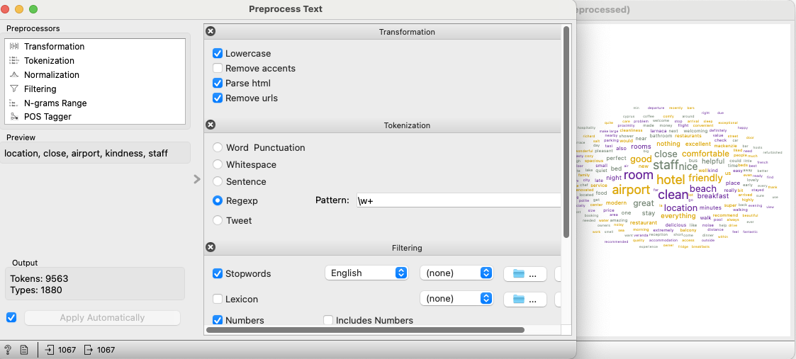
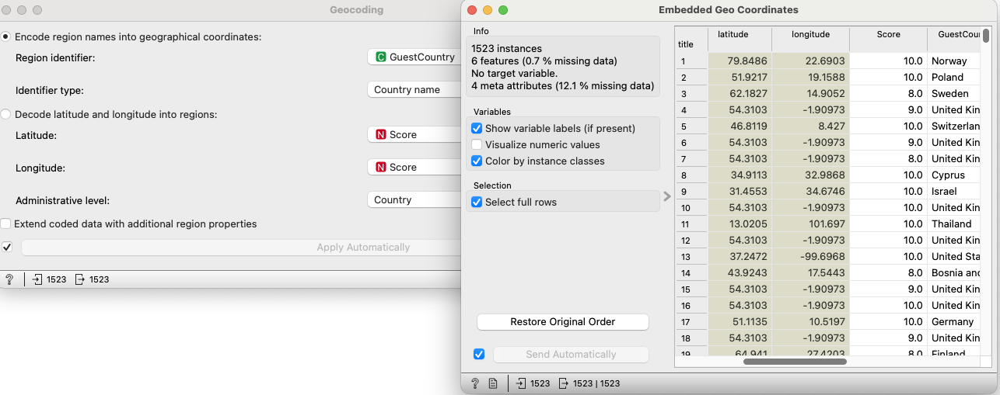
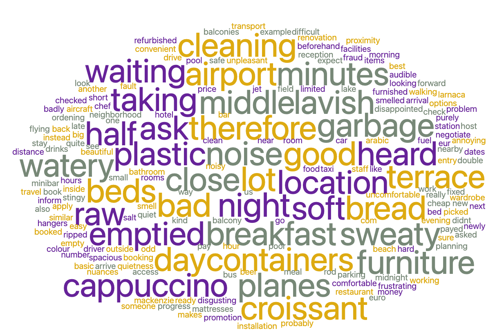
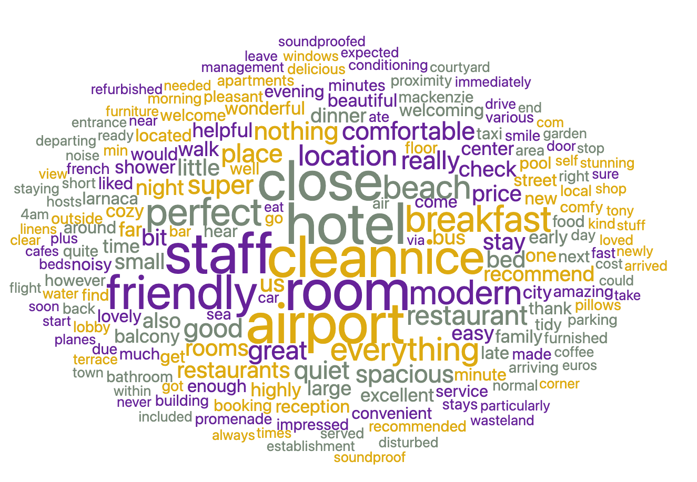
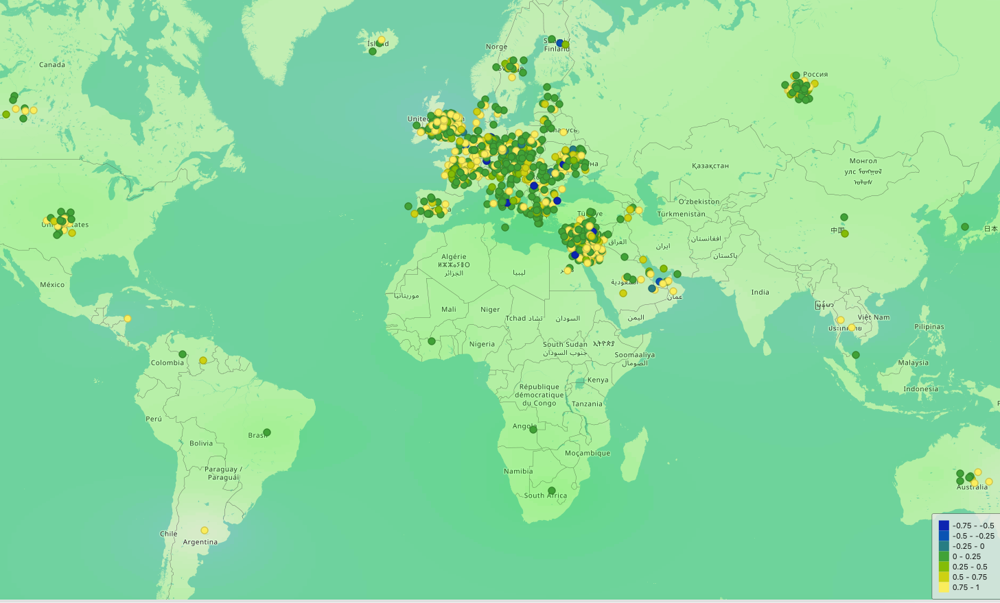
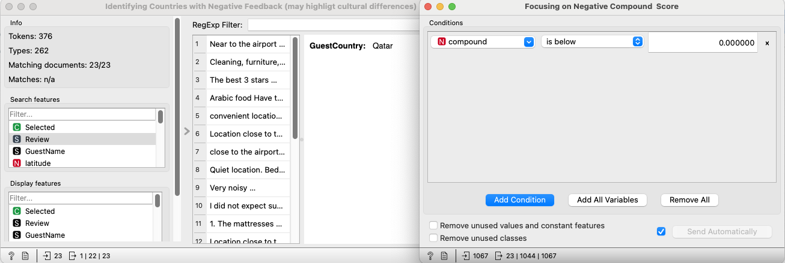
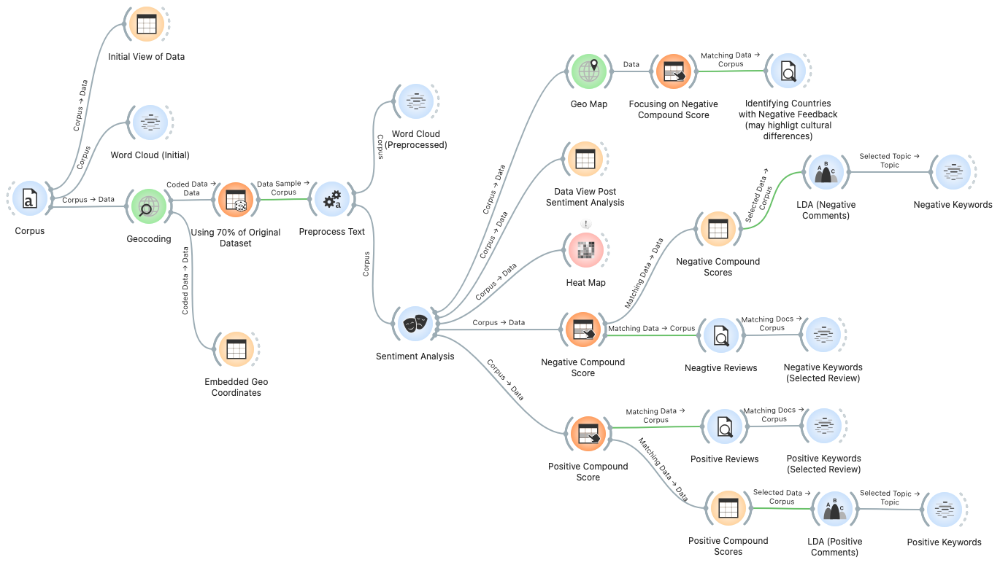

# 🏨 Booking.com Review-Based Sentiment Modelling

---

---

## 📘 Overview

This project explores 1,500 customer reviews from Booking.com for **La Veranda Hotel** in Larnaca, Cyprus, to extract insights into customer sentiment. Using Natural Language Processing (NLP) techniques like **sentiment scoring**, **topic modeling (LDA)**, and **geospatial analysis**, we uncover themes that impact guest satisfaction and provide actionable business recommendations.

---

## 📌 Objectives

- Classify guest reviews into **positive** and **negative** sentiments.
- Identify **key topics** discussed in both positive and negative reviews.
- Examine **geographic patterns** in guest satisfaction.
- Explore if **cultural differences** influence negative feedback.

---

## 📂 Dataset

- **Source:** Public dataset from [Kaggle](https://www.kaggle.com/datasets/michelhatab/hotel-reviews-bookingcom/data)
- **Size:** 1,500 guest reviews
- **Location:** La Veranda Hotel, Larnaca, Cyprus

---

## ⚙️ Data Preprocessing

- Combined positive and negative reviews into a unified column.
- Removed missing values.
- Cleaned text: punctuation, stopwords, lowercase.
- Standardized date formats.
- Geocoded guest country into coordinates.

---

## 📊 Visualizations

**🖼️ Fig 1: Preprocessed Text and Word Cloud**  
_This shows the initial word cloud after text cleaning._

**🖼️ Fig 2: Embedding Coordinates using Geocoding**  
_Guest countries were mapped to their coordinates for sentiment mapping._

---

## 📈 Results and Discussion

### 📌 3.1 Sentiment Analysis

Sentiment scores were generated using NLP tools to classify reviews.

#### Summary:
- **Positive reviews** dominate the dataset.
- **Neutral sentiments** suggest room for improvement.
- **Negative reviews** are fewer but focus on cleanliness, noise, and check-in delays.

#### 🔥 Highlights:
- Common praise: *“amazing service”*, *“perfect location”*
- Common complaints: *“dirty bathrooms”*, *“noisy rooms”*

**🖼️ Fig 3: Heat Map of Sentiment Analysis**  
_Sentiment polarity distribution by review._

**💡 Business Implications:**
- Improve cleaning standards and noise control.
- Enhance staff training during peak seasons.

---

### 📌 3.2 Topic Modeling (LDA)

Used **Latent Dirichlet Allocation (LDA)** to extract recurring themes.

#### Positive Reviews:
- **Topics:** Staff service, room comfort, hotel location
- **Keywords:** "friendly staff", "spacious room", "convenience"

#### Negative Reviews:
- **Topics:** Cleanliness, delays, room temperature
- **Keywords:** "dirty bathroom", "slow service", "noisy"

**🖼️ Fig 4A: Word Cloud - Negative Reviews**  

**🖼️ Fig 4B: Word Cloud - Positive Reviews**  

**💡 Business Implications:**
- Emphasize strengths (service, comfort) in marketing.
- Address operational weak points (cleanliness, delays).

---

### 📌 3.3 Geographic & Cultural Insights

Sentiment trends analyzed by region using guest country geocoding.

#### Observations:
- **High ratings**: Guests from Europe & North America
- **Low ratings**: Guests from regions with cultural/language differences

**🖼️ Fig 5: Geo Map of Guest Sentiment by Country**  

**🖼️ Fig 6: Countries with Higher Negative Sentiment**  

**💡 Business Implications:**
- Customize services for guests from low-rated regions.
- Focus on cultural awareness in staff training.

---

## ✅ Conclusion

Key actionable takeaways:

- Address cleanliness and noise complaints promptly.
- Showcase service quality in campaigns.
- Understand and cater to cultural expectations.

This project demonstrates the power of **NLP and machine learning** in generating **customer-centric strategies**.

---

## 📎 Appendix

- **LDA Models:** Positive vs Negative Topic Extraction  
- **Keyword Selection:** Based on selected reviews for granular insight  
- **Initial Word Cloud:** Created from raw (unprocessed) reviews  
- **Data Sampler:** 70% of dataset used to optimize Orange performance  

---

## 💻 Code Snapshot

> Snapshot of Orange's visual pipeline for this project.

---

## 🧪 Live Orange Workflow

You can explore the full Orange data mining workflow here:

🔗 [Download the Orange Workflow (.ows)](workflow/booking_sentiment_workflow.ows)

> 📌 Open it in [Orange](https://orangedatamining.com/download/) to view the complete visual pipeline.

---

## 🚀 Getting Started

To replicate the analysis:

1. Clone this repository  
2. Install [Orange](https://orangedatamining.com/download/)
3. Open `booking_sentiment_workflow.ows` using Orange
4. Explore the sentiment scoring, word clouds, and geolocation mappings interactively

---

## 📚 Reference

- **Dataset:** [Hotel Reviews on Booking.com – Kaggle](https://www.kaggle.com/datasets/michelhatab/hotel-reviews-bookingcom/data)

---

## 👤 Author

**Ramanav Bezborah**  
🔗 [GitHub Profile](https://github.com/ramanavbezborah)  

